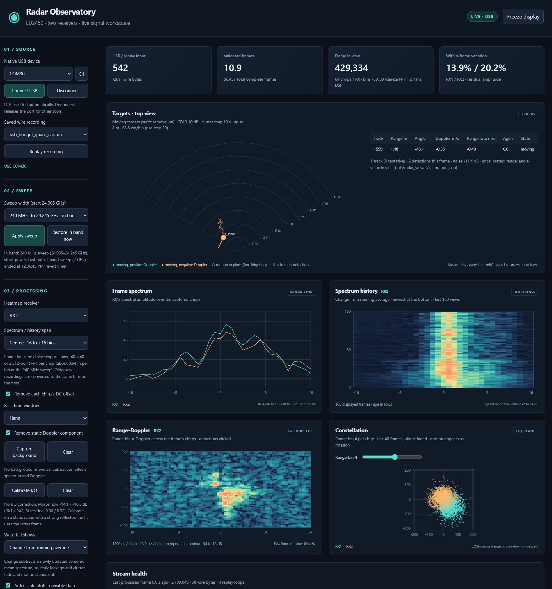

# HLK-LD2450 custom firmware

Reverse engineering and experimental JieLi BR23/AC695N firmware for the
HLK-LD2450 24 GHz radar module. The custom firmware replaces the stock target
reporting: it streams the radar's two receive channels over the module's own
USB port, and a local browser viewer does the radar processing on the host.



*The live viewer (2026-10-08): one person tracked at about 1.5 m, walking
towards the sensor at 0.4 m/s. The angle is not calibrated yet.*

## Current state (2026-10-08)

| Part | State |
|---|---|
| Updating | Stock-to-custom and custom-to-custom UART updates work at 256000 baud, with a three-second boot recovery window. |
| Radar setup | The S5KM312CL is started with the recovered stock profile, changed to a 240 MHz in-band sweep (24.005-24.245 GHz, about 0.64 m per range bin). Its registers are [mapped](docs/S5KM312CL_REGISTER_MAP.md). |
| On-device processing | Both receivers are captured continuously over SPI DMA. Each chirp goes through the BR23 hardware FFT (512 points, 53 us), and bins -40..40 are kept (about 25 m). |
| Export | All 64 chirps of every radar frame, about 11 frames/s and 540 kB/s, over native USB CDC (LDF1 codec 2). Live register reads and writes go over the same port. Installed image: [`firmware/releases/usb-bins40-20261008`](firmware/releases/usb-bins40-20261008). |
| Host viewer | Range spectra, change waterfall, 64-chirp range-Doppler map (13 Hz bins), constellation, CFAR detection on both receivers, angle from the receiver phase difference, a clutter map and Kalman tracks. Register control, and a sweep-width control for out-of-band experiments. |

Not yet calibrated:
- **Angle:** live angles still jump for one object, consistent with an
  unmeasured receiver phase offset or antenna spacing.
- **Range:** the metre scale comes from a three-point fit at the old 204 MHz
  sweep, rescaled to 240 MHz.
- **Velocity sign.**

A corner-reflector session is the next step. See the
[processing plan](DSP_plan.md) for the work log and next actions.

## Live radar viewer

```powershell
.\tools\start_radar_viewer.ps1
```

This opens http://127.0.0.1:8765. Connect to the module's native USB port
(COM30 here), or replay a saved recording. The [viewer guide](docs/LIVE_RADAR_VIEWER.md)
covers every panel, the detection and tracking parameters
(`tools/radar_viewer/calibration.json`), raw recording, and how to add a
processing stage.

**Sweep width:** the radar runs in the 24.0-24.25 GHz band by default. The
**02 / Sweep** panel can widen the sweep to 480 MHz, 1 GHz or 2 GHz (finer range
bins, shorter range), which transmits outside that band. That is the operator's
decision: each run needs an acknowledgement. The viewer drops to minimum
transmit power and returns to the in-band profile on a 2-30 minute timer, on
**Restore in band now**, on a failed write, and on disconnect or shutdown.

## Documentation

- [Live radar viewer](docs/LIVE_RADAR_VIEWER.md): panels, processing, tracking, clutter map, sweep width, registers.
- [Frame stream](firmware/docs/FRAME_STREAM.md): firmware stream images, the LDF1 wire format, the LDC1 register commands and bench evidence.
- [S5KM312CL register map](docs/S5KM312CL_REGISTER_MAP.md): registers 0x00-0x7F, sweep/timing formulas, gain tables and the hold/restart rule.
- [BR23 hardware FFT](firmware/docs/HW_FFT.md): measured behaviour of the FFT engine.
- [Processing plan](DSP_plan.md): milestones, acceptance evidence and session handoff.
- [Image build and loading](firmware/docs/IMAGE_BUILD.md), [firmware foundation](firmware/README.md) and the [UART update investigation](firmware/docs/UART_UPDATE.md).
- [Hardware evidence](docs/radar_ic_and_internal_interfaces.md) and the [PSRAM investigation](docs/PSRAM_INVESTIGATION.md).
- [Decision log](DECISIONS.md) and [debug log](DEBUG_LOG.md).

## How it got here

- **2026-10-04/05:** UART recovery application packaged into stock-layout `.ufw`
  images; first custom boot, boot recovery window and radar initialization
  (all 80 startup writes ACKed) verified on hardware. One-shot SPI capture
  recovered distinct, checksum-valid RX0/RX1 I/Q records.
  ([`hello-verified-20261005`](firmware/releases/hello-verified-20261005/README.md))
- **2026-10-06:** Continuous acquisition, a lossless chirp codec and native USB
  CDC streaming; raw 16-chirp export; live register control over USB; the first
  live viewer and software I/Q mismatch correction.
- **2026-10-07/08:** Register reverse engineering completed; the in-band 240 MHz
  sweep adopted.
- **2026-10-08:** Hardware-FFT range-bin export for all 64 chirps installed. The
  viewer moved to range bins and gained detection, angle, tracking, a clutter
  map and the sweep-width control.

## Radar register map

[docs/S5KM312CL_REGISTER_MAP.md](docs/S5KM312CL_REGISTER_MAP.md) maps the radar SoC's
registers 0x00-0x7F, combining the stock LD2450 startup capture, live bench
sweeps and a static decode of ICLegend's EVBKS5 evaluation GUI. It covers
frequency/sweep/timing formulas, sampling and SPI fields, transmit and receive
gain tables, and the hold/restart rule for waveform registers. The vendor GUI
package itself is third-party material and is not committed.

## Checks

```powershell
python firmware/tools/test_host.py
python firmware/tools/setup_sdk.py --download
python firmware/tools/setup_toolchain.py --download
python firmware/tools/build_image.py
python -m unittest discover -s tools -p test_viewer.py
```

The image builder writes `firmware/build/image/update.ufw`, the ELF/map,
application binary, commands and hash manifests. It never accesses a device.
Build caches and generated images are ignored by Git. See the image guide for
custom profiles, the experimental PC uploader and first-boot checks, and
[FRAME_STREAM.md](firmware/docs/FRAME_STREAM.md) for the stream image options.

## Provenance

The initial commit contains the existing host-tested firmware foundation,
PI32V2 component build scripts, register customization tools, and analysis
artifacts before the complete image builder was added.
`INITIAL_SNAPSHOT.json` records the exact imported file hashes.

The two stock `.ufw` files are immutable vendor reference inputs, downloaded
from `https://h.hlktech.com/Uploads/otagujian/` under their original filenames.
They and extracted vendor code remain third-party materials; no ownership or
license over them is claimed. SDK and compiler downloads are pinned separately
in `firmware/sdk.lock.json` and `firmware/toolchain.lock.json`; their caches and
installers are excluded. The EVB1122 register interpretation is an explicitly
labelled cross-chip hypothesis, not a manufacturer register specification.

Phone Bluetooth archives, unrelated upstream application files, large raw
logic-analyzer captures, and personal attachments are not part of this repo.
Captured binary test fixtures retain their source hashes and sample provenance.

## Pico USB recovery entry helper

[`tools/pico-usb-key`](tools/pico-usb-key/README.md) is an Arduino-Pico / PlatformIO
project that sends the USB entry key, tries both clock/data mappings, detects
an ACK-shaped response and supplies calibration edges before a manual cable
swap. It uses GP10/D+ and GP11/D- with removable external pull-ups supplied by GP12. A Pico W UF2
has been built and software-tested; BR23 boot entry remains unverified. This
helper does not flash the radar or forward USB traffic.
